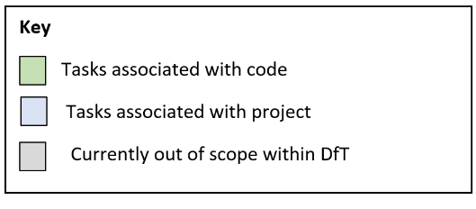
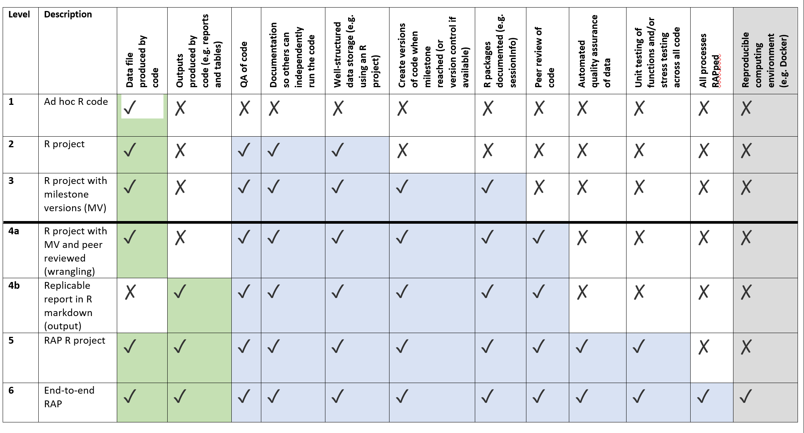
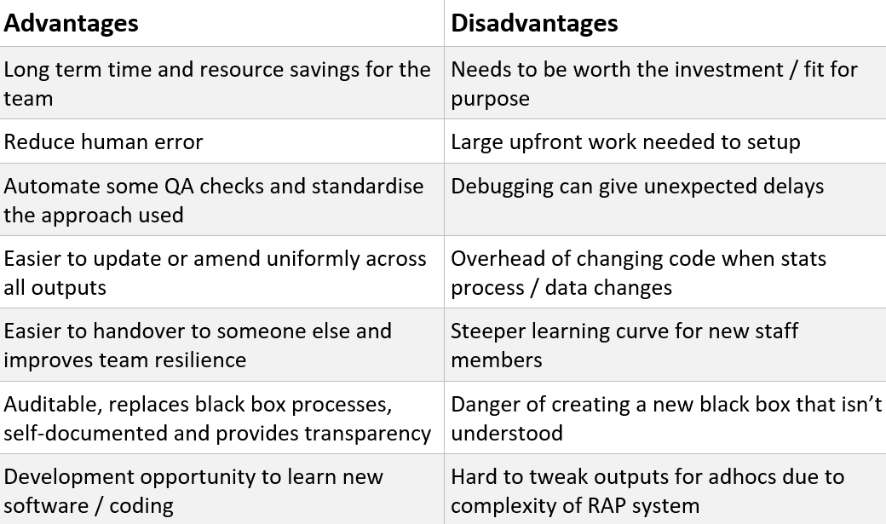

# DfT RAP guidance {#RAP}

This section provides a condensed version of the DfT RAP guidance written and amended by the DfT RAP committee.

A more in-depth guide is available internally, please ask the DfT RAP committee for the file path.

## What

This sub-chapter explains what a RAP project is using RAP levels amended from NHS Scotland RAP levels.

Use the DfT RAP levels to ensure your DfT RAP project includes everything it should. A project is considered a RAP project at level 4a and above. 

These RAP levels have been amended from the original [NHS Scotland RAP levels](https://www.isdscotland.org/About-ISD/Methodologies/_docs/Reproducible_Analytical_Pipelines_paper_v1.4.pdf) to reflect DfT processes and software capabilities. There is guidance for the descriptors below the RAP levels.

DfT RAP levels guidance

**Data file produced by code**
Your code will produce the required data. This may involve some or all of cleaning, tidying, wrangling, analysing.

**Outputs produced by code** 
Your code will automate the production of publication ready outputs, for example formatted excel publication tables or reports.

**QA of code**
Your code has been quality assured by someone else, and all comments implemented. Your manager should sign off on the code at this point.

**Documentation so others can independently run the code**
Your code should be documented so that someone else can independently run the code. This could be through comments in the code, or a separate document, such as a README.md, providing guidance.

**Well-structured data storage**
Your project should have an organised hierarchy of files and folders (we recommend using an R project), with data and outputs stored appropriately. 

**Create versions of code when milestones reached**
You should create versions of your code whenever key milestones or sections have been completed. This will allow you to find previous versions of code if something goes wrong, or the code breaks. If version control is available (e.g. Github) then this could be implemented for more advanced version control.

**R packages and versions documented**
R packages and the versions used should be documented so that if other people use your code they can ensure they have the right packages and versions to run your code. Running sessionInfo() and RStudio.Version() after loading all libraries at the start of your code will output information about the packages and RStudio versions used. See the R-Cookbook for how to capture and print this information to a file.

**Peer review of code**
Your code will need to be peer reviewed. This is less in depth than QA’ing the code but will need to be done by an experienced R user or RAP champion. NOTE: it is part of the RAP champion role to peer review RAP projects.

**Automated quality assurance of data**
Your RAP project should include automated quality assurance of data, this could be an automated QA note, or tests and checks within the code.

**Unit testing of functions and/or stress testing across all code**
Where user defined functions are created, these should be unit tested – functions written to pass tests. Where functions are not used the code must stress tested and risks documented. For example, does the code work with previous years? Are the figures at the end as expected? What happens if the data fed into the code is different? What if there are columns missing?

**All processes RAPped**
All processes that make up the pipeline are RAPped. For example, for a publication this could include automation of processes such as data collection, data tidying, data wrangling, quality assurance, producing publication ready table, charts, dashboards etc.

**Reproducible computing environment**
Using a system like docker to create a reproducible computing environment.

## When

Whilst incredibly powerful, RAP should not be seen as a solution for all the difficulties of statistics production. However, implementing even a few of the techniques can drive benefits in auditability, speed, quality, and knowledge transfer. There is a balance to be struck between ease of maintenance and the level of automation, and this is likely to differ for every publication or team.

Sometimes it is difficult to decide if you should a RAP project or not. The following table should help you identify the benefits and risks for your individual problem:

## Additional resources

There is are also quite a few links and resources which can help with a RAP project:

[RAP govdown website](https://ukgovdatascience.github.io/rap-website/resource-nhs-nss-transforming-publications-toolkit.html) is a central repository for all things RAP across government, including lots of links.

[RAP companion](https://ukgovdatascience.github.io/rap_companion/) comprehensive RAP guide.

[RAP collaboration slack channel](https://govdatascience.slack.com/messages/C6H22U3H9/convo/C17V1PCCX-1560436755.005800/)
Contact the wider RAP community for help on more complex issues through the GovDataScience slack domain (you need to be signed in for this link to work).

[GSS RAP champions page](https://gss.civilservice.gov.uk/about-us/champion-networks/reproducible-analytical-pipeline-rap-champions/). Get in contact with RAP champions from DfT and across government.

